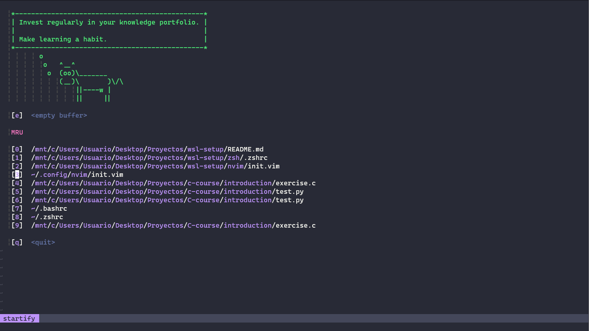
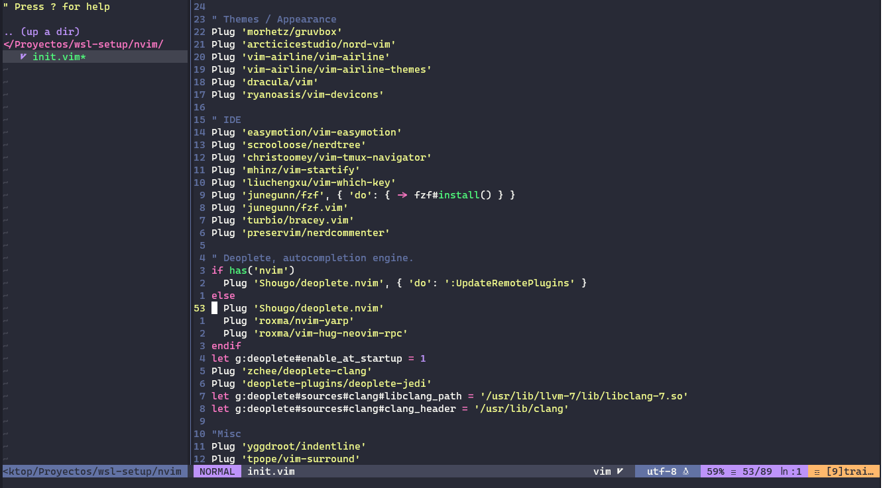

## My Windows Subsystem for Linux 2 Workflow.


<p align="center"> Startify </p>



<p align="center"> Some code </p>


## Introduction

This is some of the tools that I use daily on my workflow with WSL (I personally use Debian). 

My configurations are not well-documented enough until now, they're also not totally finished, so this is a work-in-progress. I would also upload more things that I use on a daily basis and its config files. While you can copy my whole config files, it is not recommended though. You should have your own config file. You are encouraged to copy from this repo the part you feel useful and add it to your own nvim config. 

>NOTE: I'm not an english native speaker, so it will probably be some grammar mistakes here.If you are willing to help, you will be so grateful if you can make a pull request or an issue.

### WSL

If you don't have WSL already installed, you can follow this official Microsoft's guide. [WSL installation guide](https://docs.microsoft.com/en-us/windows/wsl/install-win10)

### Neovim

### Features
* It works for all platforms
* Asynchronous auto-completion with [deoplete](https://github.com/Shougo/deoplete.nvim)
* Python autocompletion with [Jedi](https://github.com/davidhalter/jedi)
* C/C++ autocompletion with [clang](https://github.com/deoplete-plugins/deoplete-clang) 
* Fuzzy searching with [fzf](https://github.com/junegunn/fzf)
* My 3 favorite color themes, [dracula](https://github.com/dracula/vim), [nord](https://github.com/arcticicestudio/nord-vim) and [gruvbox](https://github.com/sainnhe/gruvbox-material)
* Amazing [icons](https://github.com/ryanoasis/vim-devicons)
* Lean and mean [status bar/tabline](https://github.com/vim-airline/vim-airline)
* CSS color [visualizer](https://github.com/chrisbra/Colorizer)
* Auto rename tag for [HTML](https://github.com/AndrewRadev/tagalong.vim)
* Live server with [Bracey](https://github.com/turbio/bracey.vim)
* Search words easily with [easymotion](https://github.com/easymotion/vim-easymotion)
* [Markdown Preview](https://github.com/iamcco/markdown-preview.nvim)
* Easy comments with [Nerd Commenter](https://github.com/preservim/nerdcommenter)
* Working to add more features.
### Installation
First off, you have to install [neovim](https://neovim.io/).

#### Ubuntu/Debian
```bash
sudo apt-get install neovim
```
#### Arch
```bash
sudo pacman -S neovim
```
#### Fedora
```bash
sudo dnf install -y neovim 
```

For more information about downloading neovim on your operating system, visit [the neovim installation guide](https://github.com/neovim/neovim/wiki/Installing-Neovim)

#### Setting up neovim. 

After this installation, you should have a `nvim` folder in your `~/.config` directory, but if you don't, don't worry and follow these steps.

We will have to create the folder and then change directory into it.

```shell 
# In the ~/.config directory
mkdir nvim
cd nvim
```
Then, we will create the `plugged` directory. (This is the folder where our package manager is going to download the pluggins).
```shell
mkdir plugged
```

Now we have everything ready!
### Vim-Plug

After downloading neovim, we will have to install [vim-plug](https://github.com/junegunn/vim-plug), the vim plugin manager that my configuration uses.

#### Vim

###### Unix

```sh
curl -fLo ~/.vim/autoload/plug.vim --create-dirs \
    https://raw.githubusercontent.com/junegunn/vim-plug/master/plug.vim
```

You can automate the process by putting the command in your Vim configuration
file as suggested [here][auto].

[auto]: https://github.com/junegunn/vim-plug/wiki/tips#automatic-installation

###### Windows (PowerShell)

```powershell
iwr -useb https://raw.githubusercontent.com/junegunn/vim-plug/master/plug.vim |`
    ni $HOME/vimfiles/autoload/plug.vim -Force
```

#### Neovim

###### Unix, Linux

```sh
sh -c 'curl -fLo "${XDG_DATA_HOME:-$HOME/.local/share}"/nvim/site/autoload/plug.vim --create-dirs \
       https://raw.githubusercontent.com/junegunn/vim-plug/master/plug.vim'
```

###### Linux (Flatpak)

```sh
curl -fLo ~/.var/app/io.neovim.nvim/data/nvim/site/autoload/plug.vim \
    https://raw.githubusercontent.com/junegunn/vim-plug/master/plug.vim
```

###### Windows (PowerShell)

```powershell
iwr -useb https://raw.githubusercontent.com/junegunn/vim-plug/master/plug.vim |`
    ni "$env:LOCALAPPDATA/nvim-data/site/autoload/plug.vim" -Force
```

After this, you have everything ready, so you can basically move my init.vim or create the `init.vim` file at `~/.config/nvim` with
```sh
nvim init.vim
```
And then you can paste my config. You must do `:PlugInstall`, wait until the downloads are done and then restart neovim, everything should be working fine.

## ZSH

Work in progress.

